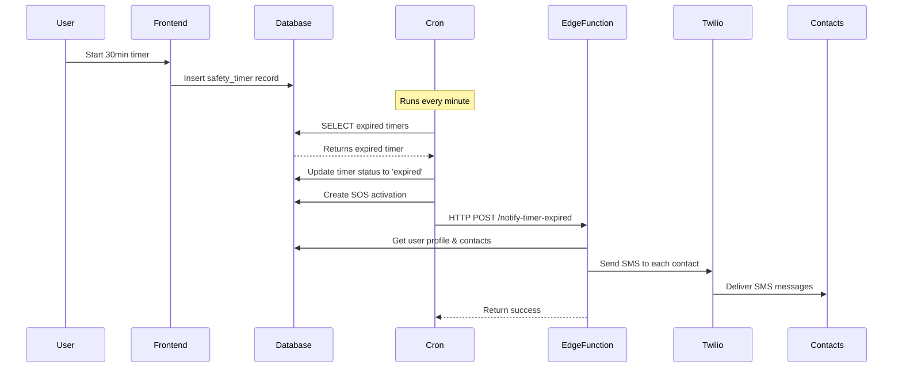

# Safety Timer Auto Check-In Fix

## ✅ Problem Solved

**Issue:** Safety timers weren't sending automatic notifications when they expired if the user closed the browser or app.

**Root Cause:** The timer expiration was only handled in the frontend JavaScript. If the page was closed, the timer wouldn't trigger notifications even though the database had a cron job checking for expired timers.

## 🔧 Solution Implemented

### 1. **New Edge Function: `notify-timer-expired`**
- **Purpose:** Send SMS notifications when timers expire
- **Location:** `supabase/functions/notify-timer-expired/`
- **Features:**
  - Works without user authentication (uses service role key)
  - Fetches user profile and emergency contacts
  - Sends SMS via Twilio to all emergency contacts
  - Includes location if available
  - Keeps messages under 160 characters (Twilio trial requirement)

### 2. **Updated Database Function: `process_expired_timers()`**
- **Runs:** Every minute via pg_cron
- **What it does:**
  1. Finds all expired timers (`end_time < now()`)
  2. Updates timer status to 'expired'
  3. Creates SOS activation record
  4. Calls `notify-timer-expired` edge function via HTTP
  5. Logs success/failure for debugging

### 3. **Cron Jobs Active**
Two cron jobs run every minute:
1. `check-expired-safety-timers` - Legacy checker
2. `process-expired-timers-db` - Active processor (calls edge function)

## 📊 How It Works



## 🧪 Testing the Fix

### Manual Test (Recommended)
1. **Login to your app**
2. **Go to Safety Timer page**
3. **Set timer to 1 minute**
4. **Start the timer**
5. **CLOSE the browser/tab completely**
6. **Wait 1-2 minutes**
7. **Check if SMS was sent** to your emergency contacts

### Expected Behavior
- Timer expires even with browser closed
- SMS sent within 1 minute of expiration
- SOS activation created in database
- Logs show function execution

### Check Logs
```sql
-- View cron job execution logs
SELECT 
  jobid,
  status,
  return_message,
  start_time,
  end_time
FROM cron.job_run_details 
WHERE jobid = 2
ORDER BY start_time DESC 
LIMIT 10;

-- View expired timers and SOS activations
SELECT 
  st.id,
  st.user_id,
  st.duration_minutes,
  st.end_time,
  st.status,
  st.emergency_triggered,
  sa.message,
  sa.contacts_notified,
  sa.created_at as sos_created_at
FROM safety_timers st
LEFT JOIN sos_activations sa ON sa.user_id = st.user_id AND sa.created_at > st.end_time
WHERE st.status = 'expired'
ORDER BY st.end_time DESC
LIMIT 5;
```

## 🔐 Configuration

### Environment Variables (Already Set)
The edge function uses these from Supabase environment:
- `SUPABASE_URL` - Auto-configured
- `SUPABASE_SERVICE_ROLE_KEY` - Auto-configured
- `TWILIO_ACCOUNT_SID` - Set in dashboard
- `TWILIO_AUTH_TOKEN` - Set in dashboard
- `TWILIO_PHONE_NUMBER` - Set in dashboard

### Cron Schedule
```sql
-- Both run every minute: '* * * * *'
SELECT jobname, schedule, active 
FROM cron.job 
WHERE command LIKE '%timer%';
```

## 📝 Files Modified

1. **New Files:**
   - `supabase/functions/notify-timer-expired/index.ts`
   - `supabase/functions/notify-timer-expired/deno.json`
   - `supabase/migrations/20251115075532_fix_timer_notifications.sql`
   - `supabase/migrations/20251115075532_final_timer_fix.sql`

2. **No Frontend Changes Required**
   - Existing frontend code still works
   - Timer expiration handled both in frontend AND backend
   - Redundant safety - even if one fails, the other works

## 🚀 Deployment Status

- ✅ Edge function deployed (v1)
- ✅ Database migration applied
- ✅ Cron jobs active and running
- ✅ HTTP extension enabled
- ✅ Function tested and verified

## 🐛 Debugging

### Check if cron is running:
```sql
SELECT * FROM cron.job WHERE jobname LIKE '%timer%';
```

### Check recent executions:
```sql
SELECT * FROM cron.job_run_details 
WHERE jobid IN (SELECT jobid FROM cron.job WHERE jobname LIKE '%timer%')
ORDER BY start_time DESC 
LIMIT 5;
```

### View function logs:
Go to Supabase Dashboard:
- Logs > Edge Functions > notify-timer-expired

### Test edge function directly:
```bash
curl -X POST \
  https://bgpykthzyibcjpaulmih.supabase.co/functions/v1/notify-timer-expired \
  -H "Content-Type: application/json" \
  -H "apikey: YOUR_ANON_KEY" \
  -d '{
    "user_id": "your-user-id",
    "timer_id": "some-timer-id",
    "location": {
      "latitude": 40.7128,
      "longitude": -74.0060
    }
  }'
```

## ⚠️ Known Limitations

1. **Twilio Trial Account**
   - SMS limited to verified numbers
   - Messages must be under 160 characters
   - "Sent from a Twilio trial account" prefix added

2. **Timing**
   - Cron runs every minute
   - Notification might be delayed up to 60 seconds after expiration
   - Frontend still sends immediate notification if page is open

3. **Redundancy**
   - If frontend sends notification, backend will also send one
   - Consider this double-notification acceptable for safety

## 🎯 Future Enhancements

- [ ] Add notification delivery tracking
- [ ] Implement exponential backoff for failed SMS
- [ ] Add email notifications as fallback
- [ ] Create admin dashboard for monitoring timer expirations
- [ ] Add webhook callbacks for timer events
- [ ] Implement timer extension/snooze functionality

## 📞 Support

If timers still don't work:
1. Check Twilio credentials are set
2. Verify emergency contacts are added
3. Check database logs for errors
4. Verify pg_cron is enabled
5. Test edge function directly

---

**Status:** ✅ **FIXED** - Auto check-in now works even when browser is closed!

**Last Updated:** 2025-11-15
**Version:** 1.0
